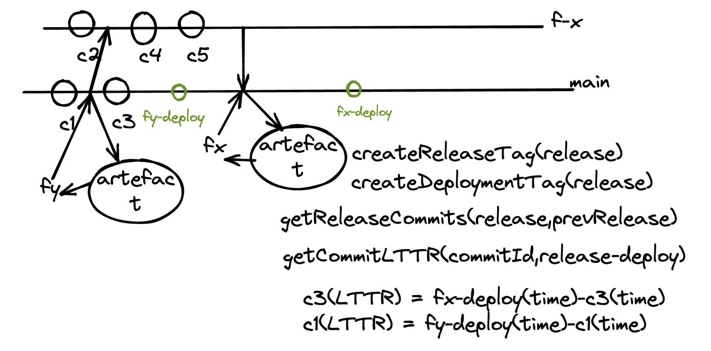

# BP-DORA-LTTR-STEP
BP Step to calculater Lead Time to Release for commits

## Design
Below is rough reference diagram on how to calculate LTTR


## Tasks
* Create Release Tag | A tag will be created in git for a release whenever it is marked as completed.
```
createReleaseTag(release name)
```
* Create Deployment Tag | A tag will be created in git whenever a release will actually be deployed in production system.
```
createDeploymentTag(release name)
```
* Get release commits | This task will return a list of all the commits between a release and previous release.
```
getReleaseCommits(release name, previous release name)
```
* Get commit LTTR | This task will return LTTR for a particular commit.
```
getCommitLTTR(commit id, release name)
```
* Get LTTR of all the commits of a release | This taks will get the LTTR for all the commits of a release
getReleaseCommitsLTTR(release name, previous release name)